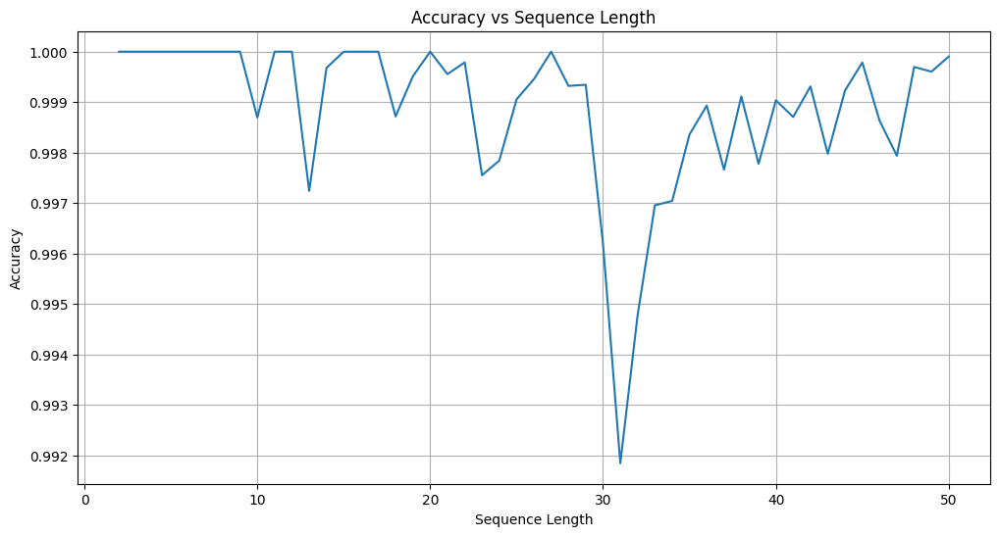

# interp_variable_list
Training and interpreting a transformer to sort lists of variable length. From Neel Nanda's 200 concrete open problems in mechanistic interpretability. in progress.

Trained a 1 layer 4 head attn only transformer

Accuracies

